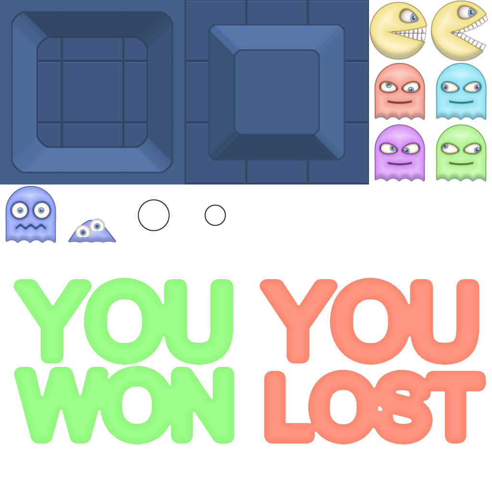

# Design Patterns Assignment
Team: Anton Hedlund, Magnus Andersson, Johan Brandt, Erik Lund

## Pacman Clone
Our game is a basic Pacman clone; with many but not all features of the original game. We have built the code in two distinct projects; an Engine part and a game part. 

The Engine project wraps all SDL functionality, such as window management, rendering and input management, as well as data types, and file loading.

The Game project handles all gameplay, with a tickable World->Actor->ActorComponent hierarchy. It does not interact directly with the SDL library.

The image in the left side of this table is an early version of the map using dummy sprites to visualise the level. The right image is the final version; which is generated in runtime based on the gameplay grid in the [CellSpriteGenerator.h](PacmanClone/source/Grid/CellSpriteGenerator.h), using the Sprite Atlas found below.

| Early Dummy Map | Real Map | 
| --- | --- |
|  |  

| Sprite Atlas |
| --- | 
|  |

## Patterns used
### Game Loop & Update Method
It seemed almost impossible to make our game without using these two patterns. The game loop is required for the SDL rendering to function properly while handling game logic and input. Choosing to manage game entities with an update (tick) method was only marginally less obvious; it let us manage game objects as you would in engines like Unity and Unreal, making it very easy to apply the Component pattern as well (see below.)

[GameBase.h](/GameEngine/source/Engine/Game/GameBase.h) is defined in the Engine, and manages the **main game loop** with input handling, **DeltaTime-ticking**, rendering, and FPS-locking, in that order. The base is extended by [PacmanGame.h](PacmanClone/source/Game/PacmanGame.h) which manages the actual game initialization with map generation using [GridGenerator.h](PacmanClone/source/Grid/GridGenerator.h) which uses level information parsed from a CSV file by [PacmanLevelInfoParser.h](PacmanClone/source/Game/PacmanLevelInfoParser.h). The actual level information is stored as a simple [.txt file](PacmanClone/MapGenFiles/LevelInfo.txt) with a pre-determined pattern given by the enums in the GridGenerator.

### Broker & Observer
The main gameplay involves eating lots of dots. To be able to separate the dots being eaten from win conditions and possible score-keeping; we decided to combine the Observer and Broker patterns. Normally a Broker might use a generic message system; but for the scope of our game we instead went with a few pre-determined Observable Events, defined in [Event.h](PacmanClone/source/Event/Event.h). These are all statically accessible through the [EventBroker.h](PacmanClone/source/Event/EventBroker.h). When a dot is eaten, it invokes the respective Event in the Broker, and other systems can register their functions as observers without changing the functionality of the dot.

### Component
As mentioned above, the game's objects are managed in a World->Actor->ActorComponent hierarchy. There are multiple [ActorComponent.h](PacmanClone/source/World/Actors/ActorComponent.hpp) implementations, such as [SpriteComponent.h](PacmanClone/source/World/Actors/SpriteComponent.hpp) which keeps information about what needs to be rendered on screen, using the Actor's [Transform.h](GameEngine/source/Data/Transform.hpp) to determine location and size. This component is the only thing that the renderer needs to be able to visualize an object on screen. Movement is also handled in the [MovementComponent.h](PacmanClone/source/Movement/MovementComponent.h). Once again, using a Component pattern let us avoid inheritance when possible, while working in a way that resembles the way you would in one of the more extensive game engines.

### Flyweight
Since our game uses a Sprite Atlas for our in-game sprites, we realised it would be an excellent use case for the Flyweight pattern. We decided to make the [Sprite.hpp](GameEngine/source/Data/Visuals/Sprite.hpp) and [SpriteComponent.h](PacmanClone/source/World/Actors/SpriteComponent.hpp) separate, and multiple Components can reference a single Sprite. That way we only have to load and store each texture once even if we render it hundreds of times per frame, such as with the edible Dot. 

We do this by using an [AssetLoader.hpp](GameEngine/source/Engine/Asset/AssetLoader.hpp) which we tell to pre-load all textures at the start of the game, generating the necessary Sprite objects. A SpriteComponent can then ask the AssetLoader for a reference to the Sprite it wants to render. Finally, the Renderer uses the SpriteComponent's owner's Transform to determine location and size for rendering.

### State
For the hostile ghosts in our game we decided to use the State pattern, since the ghosts' behaviours are discrete and pre-determined. Each ghost is always in one of four possible states; Chase, Scatter, Frightened, and Dead, all of which are separate classes that implement the [IAIState.h](PacmanClone/source/Ghosts/States/IAIState.h) interface. Each ghost is equipped with a [StateMachine_Component.h](PacmanClone/source/Ghosts/States/StateMachine_Component.h), which is an ActorComponent. The StateMachine initializes one of each state class and then saves a pointer that always points to whichever one is the current state. Whenever the ghosts needs to make an action which varies depending on which state they're in they simply run the corresponding method override, i.e. OnStateRunning(), in the current state.

## ~~Mistakes~~ Learnings
### Smart Pointers (or; sharing is **not** caring)
Being used to the comforts of Unreal Engine, we found ourselves misusing smart pointers somewhat. Most of the pointers being passed around the game are **shared_ptr**. This seemed like a nice way to make sure things don't randomly get destroyed while in use.

Unfortunately, towards the end of the project we started having issues because of this, since there's no healthy way to manually destroy an object owned by **shared_ptr**'s. For example, our **Actor** objects are owned entirely by the **World** object. In hindsight, we realized that they should have been managed using **unique_ptr**'s instead, so that we could easily call a **World->Destroy(Actor)** function. The overuse of **shared_ptr**'s made this impossible, and we had to take some less-than-optimal shortcuts to work around it.

In future projects using C++ without an engine to manage memory, we should put a lot more effort into considering what pointer types to use, and worry more about ownership.

### Don't overgeneralize
The movement pattern of Pacman and the ghosts might seem similar, but they actually function very differently. Ghosts can't turn backwards; except when Pacman eats an Energizer. Ghosts can't take shortcuts around corners, but Pacman can!

When we built the [MovementComponent.h](PacmanClone/source/Movement/MovementComponent.h) it was originally intended to be a shared component that both Pacman and the ghosts could use. This turned out to make it **very** hard to write the code, as there were so many ifs and buts.

Eventually, we realized that the functionality needed to be separated into a baseclass with 2 children, [ZakuMovementComponent.h](PacmanClone/source/Movement/ZakuMovementComponent.h) and [GhostMovementComponent.h](PacmanClone/source/Movement/GhostMovementComponent.h).
